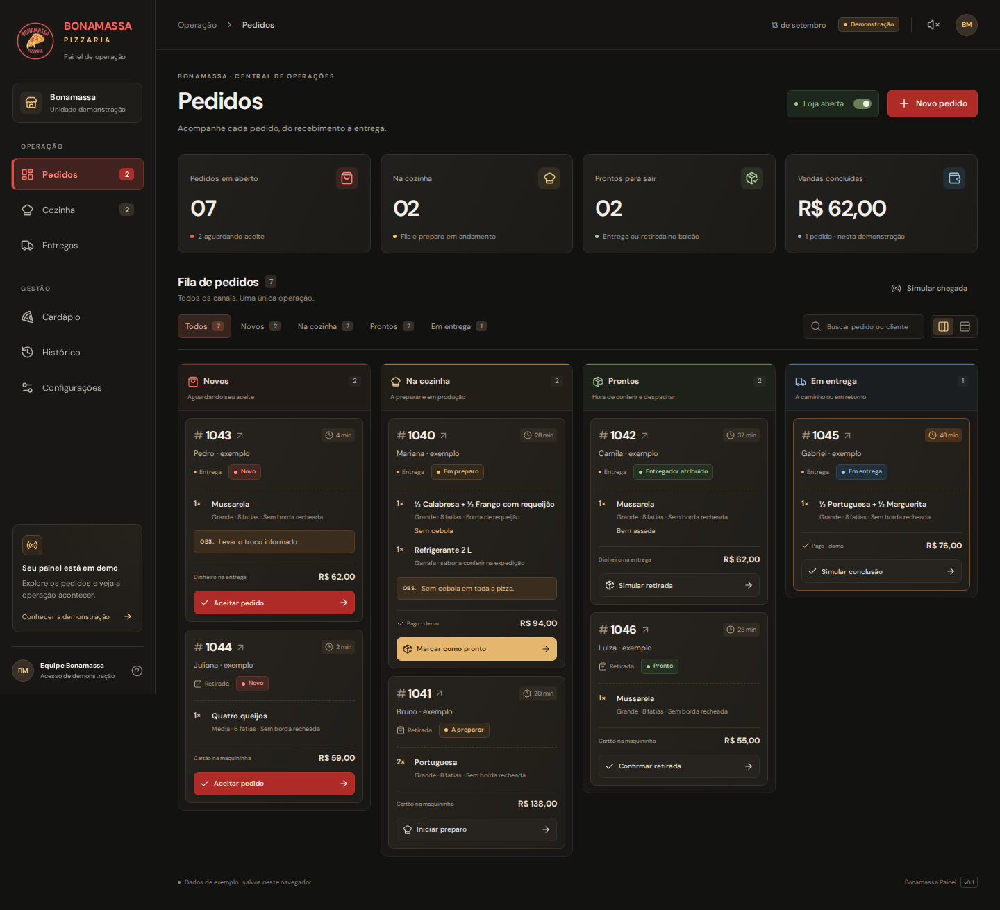
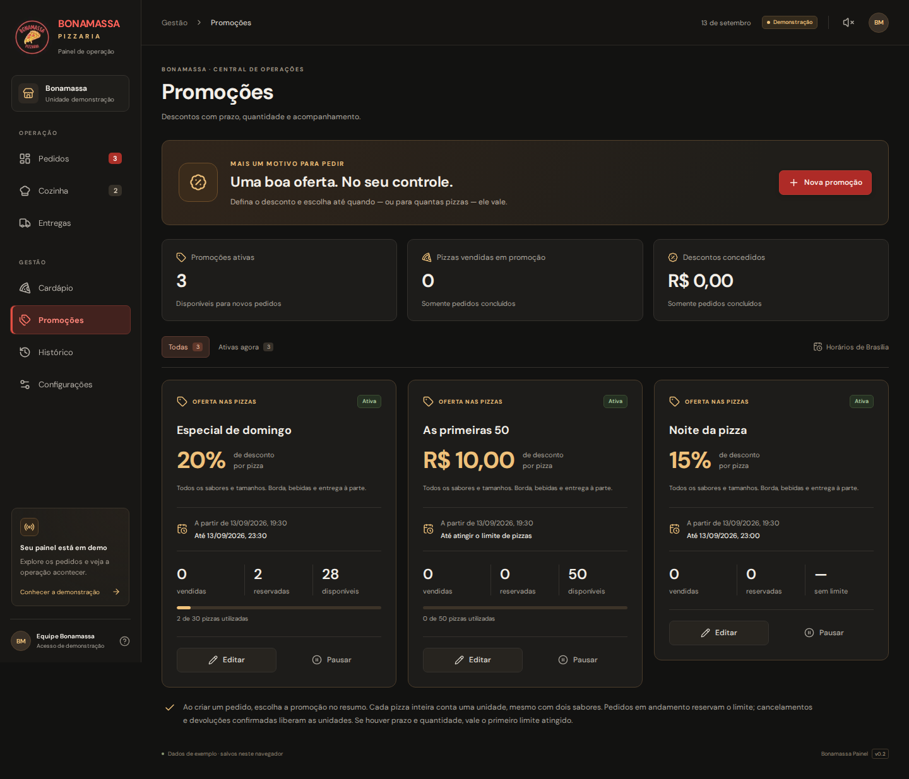
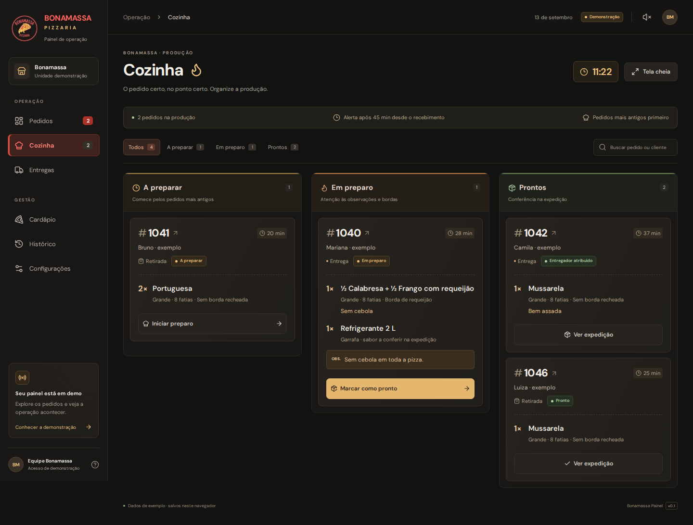

# Bonamassa Painel

Painel web da pizzaria, com **recebimento de pedidos, cozinha (KDS) e expedição**. Interface em português, com a identidade preta, vermelha e dourada dos aplicativos Bonamassa.

**Versão 0.3.0-demo:** funcional com categorias, sabores, bordas, bebidas, combos, fotos no cardápio e promoções por prazo ou quantidade de pizzas, usando dados locais de demonstração. Ainda não há API central, autenticação ou conexão com os aplicativos Android. Nenhum pedido, pagamento ou mensagem real é enviado.



## Abrir no computador

Instale o **Node.js 24**, incluindo o npm. Este projeto abre no navegador; use VS Code ou outro editor para trabalhar no código.

Na primeira vez:

```bash
git clone https://github.com/nvpetri/BonamassaPainel.git
cd BonamassaPainel
npm ci
npm run dev
```

Abra [http://localhost:3000](http://localhost:3000). Não precisa configurar banco, chave de API ou arquivo `.env` nesta demonstração.

Se você já clonou o repositório, entre na pasta do painel e atualize:

```bash
git pull --ff-only origin main
npm ci
npm run dev
```

No Windows, se o PowerShell bloquear `npm.ps1`, execute pelo **Prompt de Comando**, ou use `npm.cmd ci` e `npm.cmd run dev`. Não é necessário alterar a política de execução do computador.

Para usar a compilação otimizada:

```bash
npm run build
npm start
```

O terminal precisa continuar aberto enquanto o servidor estiver sendo usado. Encerre com `Ctrl+C`. Para outra porta: `npm run dev -- --port 3001`.

## Telas disponíveis

| Caminho          | O que funciona                                                                                                    |
| ---------------- | ----------------------------------------------------------------------------------------------------------------- |
| `/pedidos`       | Colunas/lista, busca, filtros, novo pedido, aceite, andamento, detalhes e pausa de novos pedidos                  |
| `/cozinha`       | A preparar, em preparo e prontos; observações, tempo de espera e tela cheia                                       |
| `/entregas`      | Disponibilidade, atribuição e troca de motoboy antes da coleta; simulação de retirada, saída, entrega e devolução |
| `/cardapio`      | Categorias, tradicionais/especiais, meio a meio, bordas, bebidas, combos, fotos e preços                          |
| `/promocoes`     | Desconto percentual ou em reais por pizza, agendamento, prazo, limite de unidades, pausa e acompanhamento         |
| `/historico`     | Concluídos, cancelados e devolvidos; busca, eventos e exportação CSV                                              |
| `/configuracoes` | Meta de tempo, taxa padrão, exportação JSON e reinício confirmado da demo                                         |

Os pedidos aceitam até dois sabores, três tamanhos, bordas, bebidas, quantidade e observações. O maior preço entre os sabores determina a pizza; a borda é somada uma vez por unidade. Valores são calculados em centavos. Essa regra, os sabores e todos os preços precisam ser aprovados pela pizzaria.

Pagamentos são **registros simulados**: antecipado, dinheiro com troco ou cartão na maquininha. A conclusão exige recebedor e, no dinheiro/cartão com valor a cobrar, confirmação do recebimento. A taxa de entrega exibida é cobrada do cliente; não representa automaticamente a remuneração do motoboy.

## Novos sabores e fotos

Em **Cardápio → Pizzas → Novo sabor**, escolha o grupo **Tradicionais** ou **Especiais** e preencha nome, descrição e preços para pequena, média e grande. Você pode cadastrar o sabor disponível ou pausado. Depois de salvar, ele aparece no cardápio; quando disponível, também pode ser escolhido nos novos pedidos, inclusive meia a meia e com promoções.

Use **Selecionar foto** no cadastro, ou **Editar → Selecionar foto** em um produto existente. A prévia aparece antes de salvar. Para substituir ou apagar, use **Trocar foto** ou **Remover foto** e confirme em **Salvar produto**. Cancelar a janela mantém o cadastro anterior. A foto é opcional, e os produtos sem imagem continuam com a ilustração padrão.

- Arquivos aceitos: **JPG, PNG ou WebP, até 10 MB e 48 megapixels**. Arquivos inválidos mostram uma mensagem sem apagar a foto anterior.
- O navegador decodifica e otimiza a imagem: até **1.200 pixels no maior lado** e **200 KB** por foto salva, em WebP ou JPEG. A imagem original não é armazenada. Os cartões usam enquadramento central.
- Nome e preços válidos são obrigatórios. Nomes duplicados na mesma categoria são recusados, mesmo com diferenças de acento, espaços ou maiúsculas. Há um limite de 200 produtos na demo.
- Fotos e novos sabores ficam no IndexedDB do mesmo navegador/origem, junto dos demais dados, e permanecem após recarregar. O JSON de exportação inclui as fotos otimizadas. Elas ainda não são enviadas aos aplicativos Android.
- O snapshot usa schema 3, com categorias, foto opcional e composição dos combos. O IndexedDB passa à versão 4 para impedir que abas com código antigo descartem esses dados ao salvar. Os dados anteriores são preservados; **recarregue as abas do painel após atualizar o servidor**.

## Categorias e combos

O cardápio tem as categorias **Pizzas, Bordas, Bebidas e Combos**, com busca, foto, edição de preço e pausa por produto. Em Pizzas, os filtros **Tradicionais** e **Especiais** organizam os sabores. O grupo pode ser alterado na edição sem duplicar o cadastro.

- **Meio a meio:** selecione dois sabores diferentes, tamanho e borda na aba de mesmo nome. A prévia mostra o maior preço entre os sabores mais uma borda por pizza. **Montar pedido com esta pizza** abre um pedido com a combinação no resumo. Esta é uma forma de montar a pizza; os sabores continuam nos seus grupos.
- **Bordas:** use **Nova borda** para informar nome, foto e preço adicional por pizza. O preço é único para os três tamanhos. A opção sem borda recheada continua gratuita. Pausar uma borda impede novas seleções; pedidos existentes mantêm o valor contratado.
- **Bebidas:** use **Nova bebida**, com apresentação/volume no nome e preço por unidade.
- **Combos:** use **Novo combo** e adicione de 2 a 6 linhas à composição. Para cada pizza, escolha **Pizza inteira** (um sabor) ou **Meio a meio** (dois sabores diferentes), além de tamanho, borda, quantidade e observação. Use o lápis de cada linha para alterar um item e confirme em **Atualizar item**; **Cancelar edição do item** mantém a linha anterior. As bebidas têm apresentação e quantidade definidas. A quantidade de cada linha e a quantidade de combos no pedido vão de 1 a 20. Não há combo dentro de outro combo.

Em **Defina o preço do conjunto**, a soma dos **Itens vendidos separadamente** serve de referência. Digite o valor desejado em **Preço do combo**: a tela calcula a diferença em reais e o percentual. Exemplo: calabresa grande de R$ 59 + refrigerante de R$ 12 = R$ 71; preço do combo de R$ 65 gera economia de R$ 6 (8,45%). O cartão do combo também exibe essa comparação quando há desconto.

A comparação usa as quantidades, o tamanho e a borda de cada pizza. Meio a meio usa o maior sabor, sem somar duas pizzas inteiras. **Usar preço dos itens separados** preenche o campo com a soma atual; você pode editar depois. Valor zero é recusado, e um preço acima da soma é apresentado como diferença para cima, sem anunciar economia. O preço final salvo é independente: alterar a receita ou os preços individuais atualiza a referência, mas mantém o valor do combo até você editá-lo. Os formatos e sabores são escolhidos no cadastro da composição.

Os combos aparecem no **Novo pedido → Combo**. O preço é o cadastrado para o conjunto; a borda e as bebidas da composição já estão incluídas. A cozinha, a comanda e o resumo mostram os componentes com as quantidades multiplicadas pela quantidade de combos. Pausar um sabor, borda ou bebida da receita bloqueia novas vendas do combo; reativar restaura sua disponibilidade, desde que o próprio combo esteja ativo. Alterar a receita ou os preços não muda pedidos existentes.

Combos não acumulam descontos de pizzas avulsas. Num pedido com combo e pizza avulsa, somente a pizza avulsa é elegível para a promoção. As categorias e receitas são locais ao painel nesta demo; a sincronização com os apps depende da API central.

Nos cartões de novos pedidos, **Aceitar pedido** aparece em verde e **Cancelar pedido** em vermelho, logo abaixo. Cancelar abre a confirmação com motivo obrigatório. Os mesmos botões aparecem no detalhe do pedido.

## Promoções

Em **Promoções → Nova promoção**, informe um nome, escolha desconto em **%** ou **R$ por pizza** e defina quando começa. Escolha **data/horário de encerramento**, **quantidade máxima de pizzas**, ou ambos. Os horários são de Brasília, mesmo em um computador configurado em outro fuso.

Exemplos: 15% até domingo às 23h; R$ 10 nas primeiras 50 pizzas; 20% nas primeiras 30 pizzas até o fim da noite. Se houver dois limites, a promoção deixa de aceitar novos usos no primeiro atingido.

No **Novo pedido**, adicione os itens e selecione a **Promoção do pedido** no resumo. O sistema não escolhe uma oferta automaticamente e não acumula promoções. O resumo mostra o desconto, o total e quantas pizzas foram contempladas. Borda recheada, bebidas, combos e taxa de entrega mantêm o preço normal.

- O desconto considera todos os sabores e tamanhos. Meia a meia conta uma pizza e usa o preço do sabor mais caro. Percentuais são arredondados em centavos por unidade; desconto fixo não ultrapassa o preço da pizza.
- A quantidade é de pizzas com desconto, não de pedidos ou fatias. Se restam duas unidades e o pedido contém três pizzas, as primeiras duas na ordem dos itens recebem a oferta; a terceira mantém o preço normal.
- Pedidos em andamento **reservam** as unidades. A conclusão converte reserva em **venda**. Cancelamento e devolução confirmada liberam a reserva; registrar um problema na entrega ainda não libera unidades.
- **Pausar**, editar ou encerrar a promoção não altera o preço de pedidos existentes. Editar também não reinicia o contador. Crie outra promoção para começar uma nova campanha com contador independente.
- O limite não pode ser reduzido abaixo do que já foi vendido ou reservado. A última unidade é disputada em uma transação local: duas abas não conseguem ultrapassar a cota. Se preço ou disponibilidade mudarem durante o envio, o pedido é recusado e o resumo precisa ser conferido novamente.
- O histórico e o CSV preservam nome da promoção, desconto e número de pizzas contempladas, inclusive em cancelamentos. Os indicadores de descontos concedidos e pizzas vendidas consideram somente pedidos concluídos.



Ao atualizar dos schemas 1 ou 2, os dados são migrados automaticamente para o schema 3, preservando pedidos, fotos, preços, eventos, promoções e preferências. Os sabores antigos entram em Tradicionais e as duas bordas antes fixas passam a ser produtos editáveis. Recarregue as abas abertas depois de atualizar o servidor. Não é necessário reiniciar a demonstração.

## Roteiro para mostrar ao dono

1. Abra `/pedidos` e clique em **Novo pedido**. Monte uma grande de meia Calabresa/meia Frango, borda de requeijão e um refrigerante. Com taxa de R$ 7,00, o exemplo soma **R$ 94,00**. Selecione dinheiro e troco para R$ 100,00: o troco será **R$ 6,00**.
2. Aceite o pedido. Em outra aba do **mesmo navegador e endereço**, abra `/cozinha`.
3. Inicie o preparo e marque como pronto. As duas abas recebem a atualização.
4. Em `/entregas`, abra o pedido e atribua um entregador disponível. Simule retirada e saída.
5. Simule a conclusão, informe quem recebeu e confirme o pagamento. Consulte o resultado em `/historico`.
6. Para um pedido de retirada, a conclusão acontece no balcão e não exige entregador.

Também é possível simular uma chegada com um clique, registrar tentativa sem sucesso e retorno à pizzaria, imprimir uma comanda pelo navegador ou abrir o endereço de exemplo no Google Maps. O som de novos pedidos é ativado pelo botão do alto da tela e funciona enquanto a aba permite áudio.



## Como os dados funcionam

- IndexedDB guarda o estado entre recarregamentos. Operações são gravadas em transações, com validação dos dados e versões dos pedidos.
- BroadcastChannel avisa as outras abas do mesmo navegador/origem. Ao voltar à aba, o painel também consulta o estado salvo.
- `localhost:3000`, `127.0.0.1:3000`, outra porta, outro navegador ou outro dispositivo **têm dados separados**. Abrir a cozinha em um tablet não a conecta ao computador nesta versão.
- O snapshot tem schema e identificador da demonstração. Dados inválidos geram uma tela de recuperação; não são apagados automaticamente.
- Há um limite de 500 pedidos na demo. O CSV exporta os pedidos do histórico conforme os filtros. O JSON exporta a cópia completa para consulta; importação ainda não implementada.
- Há um limite de 100 promoções na demo. O controle de quantidade vale apenas para as abas que compartilham o mesmo IndexedDB. O limite compartilhado com os apps Android depende da futura API central.
- A hora exibida usa `America/Sao_Paulo`; os tempos são calculados a partir do relógio do dispositivo. Os dados fictícios iniciais são ancorados na primeira abertura, sem reinício diário automático.
- Não há Service Worker nem instalação PWA: após carregar, as ações locais não dependem de internet, mas recarregar ainda depende do servidor do painel.

## Desenvolvimento e verificação

Stack: Next.js 16.3.5, React 19.3, TypeScript, CSS próprio, Zod e IndexedDB. Fontes e logo são servidos pelo projeto; não há dependência de imagens remotas. As versões exatas estão no `package-lock.json`.

| Pasta            | Responsabilidade                                                          |
| ---------------- | ------------------------------------------------------------------------- |
| `src/app`        | Rotas, layout e estilos responsivos                                       |
| `src/components` | Telas, formulários, detalhes e contexto do painel                         |
| `src/domain`     | Regras, cálculo dos itens, schema, fixtures e testes de domínio           |
| `src/data`       | Interface de repositório e persistência da demonstração                   |
| `tests`          | Fluxos reais de navegador com Playwright e verificações de acessibilidade |
| `docs`           | Integração proposta, roteiro de validação e capturas das telas            |

```bash
npm run typecheck
npm run lint
npm test
npm run build
npx playwright install chromium
npm run test:e2e
```

No Linux, o instalador pode precisar de `npx playwright install --with-deps chromium`. O Playwright inicia e encerra o servidor de testes. Há workflow de CI para repetir a validação em pushes e pull requests.

[Resultados e limites da verificação](docs/VERIFICACAO.md) · [Contrato proposto para a API central](docs/INTEGRACAO.md)

## Próxima etapa

Construir a API central, autenticação/perfis e banco PostgreSQL; então substituir `demoRepository` por chamadas autenticadas e conectar o painel aos Android. A interface `PanelRepository` separa o acesso aos dados, mas não constitui uma API de produção.

Os projetos seguem independentes:

- [App do cliente](https://github.com/nvpetri/BonamassaAndroid)
- [App do entregador](https://github.com/nvpetri/BonamassaEntregador)
- [Este painel](https://github.com/nvpetri/BonamassaPainel)

PIX, WhatsApp, rastreamento GPS, permissões reais, emissão fiscal e implantação operacional são etapas posteriores. O logo foi reutilizado do app Bonamassa Entregas fornecido neste projeto; os direitos da marca permanecem com seus titulares.
